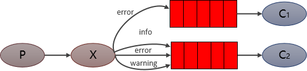

队列与交换机的绑定，不能是任意绑定了，而是要指定一个 RoutingKey（路由key）
消息的发送方在向 Exchange 发送消息时，也必须指定消息的 RoutingKey
Exchange 不再把消息交给每一个绑定的队列，而是根据消息的 Routing Key 进行判断，只有队列的Routingkey 与消息的 Routing key 完全一致，才会接收到消息

图解：
P：生产者，向 Exchange 发送消息，发送消息时，会指定一个routing key
X：Exchange（交换机），接收生产者的消息，然后把消息递交给与 routing key 完全匹配的队列
C1：消费者，其所在队列指定了需要 routing key 为 error 的消息
C2：消费者，其所在队列指定了需要 routing key 为 info、error、warning 的消息

Routing 模式要求队列在绑定交换机时要指定 routing key，消息会转发到符合 routing key 的队列。
