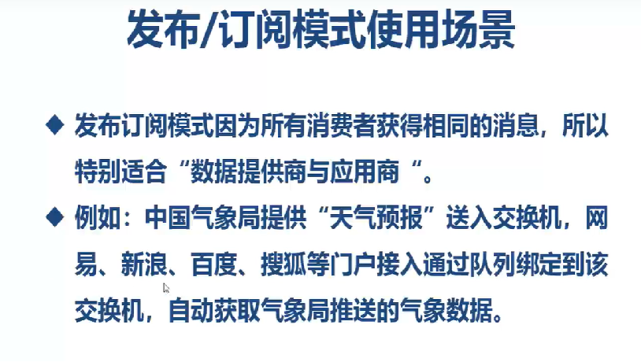

Pub/Sub  发布订阅模式
1. 交换机需要与队列进行绑定，绑定之后；一个消息可以被多个消费者都收到。
2. 发布订阅模式与工作队列模式的区别：
   工作队列模式不用定义交换机，而发布/订阅模式需要定义交换机
   发布/订阅模式的生产方是面向交换机发送消息，工作队列模式的生产方是面向队列发送消息(底层使用默认交换机)
   发布/订阅模式需要设置队列和交换机的绑定，工作队列模式不需要设置，实际上工作队列模式会将队列绑 定到默认的交换机

1. 交换机需要与队列进行绑定，绑定之后；一个消息可以被多个消费者都收到。
2. 发布订阅模式与工作队列模式的区别：
   工作队列模式不用定义交换机，而发布/订阅模式需要定义交换机
   发布/订阅模式的生产方是面向交换机发送消息，工作队列模式的生产方是面向队列发送消息(底层使用默认交换机)
   发布/订阅模式需要设置队列和交换机的绑定，工作队列模式不需要设置，实际上工作队列模式会将队列绑 定到默认的交换机 

