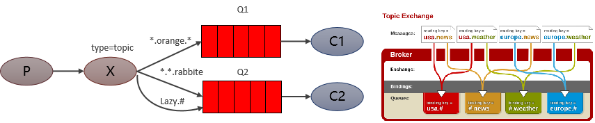

Topic 类型与 Direct 相比，都是可以根据 RoutingKey 把消息路由到不同的队列。只不过 Topic 类型Exchange 可以让队列在绑定 Routing key 的时候使用通配符！
Routingkey 一般都是有一个或多个单词组成，多个单词之间以”.”分割，例如： item.insert
通配符规则：# 匹配一个或多个词，* 匹配不多不少恰好1个词，例如：item.# 能够匹配 item.insert.abc 或者 item.insert，item.* 只能匹配 item.insert

红色 Queue：绑定的是 usa.# ，因此凡是以 usa. 开头的 routing key 都会被匹配到
黄色 Queue：绑定的是 #.news ，因此凡是以 .news 结尾的 routing key 都会被匹配

Topic 主题模式可以实现 Pub/Sub 发布与订阅模式和 Routing 路由模式的功能，只是 Topic 在配置routing key 的时候可以使用通配符，显得更加灵活。
